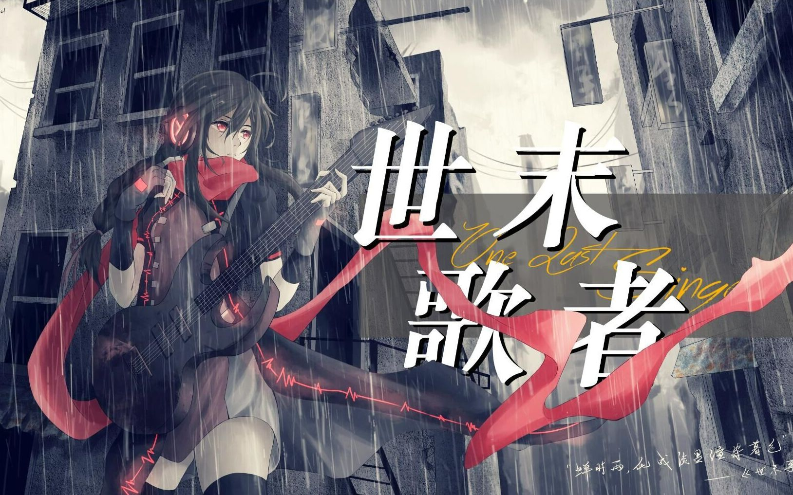

**发布日期：2026/4/5**

> 【神话贺电】世末歌者(av6009789)
> 达成时间 2026/4/5 19:01(10000001)
> 投稿时间2016/8/25 22:15
> 用时3509天20时45分
> UP主：COPY

阴雨霉湿的街角 无人问津的歌曲
冰冷的多雨的城市困囚了多少挣扎的池中之鱼
人们总是如此麻木 不愿为多余的琴音停留片刻
直到孤独的歌者对一切崩塌都习以为常
故事不止终结于此 歌者仍在执着地拨动琴弦
为了赢得神明的赌局 也为那个凡人的回眸
千万个轮回 千万次驻足 即使仅是片刻
是否足够迎来无数次祈求的结局？
——《世末歌者》1000万再生达成纪念
2016.8.25-2026.4.5
《世末歌者》
词曲：COP
绘：唯Tu
影：saiqomo
logo：少年莫然
实拍素材：莫雪 冰镇甜豆浆
压制：ZHider
 [https://www.bilibili.com/video/BV1Qs411k7Qv/](https://www.bilibili.com/video/BV1Qs411k7Qv/)

