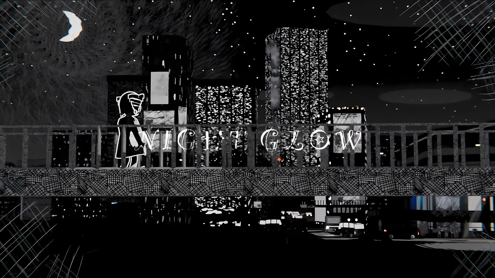

Night Glow
——光与夜交织成影，日常与超现实融合，为夜晚的你送上赞歌

Night Glow，”夜光“，这首乐曲就像它的名字一样，充满了House与City pop的韵味。笔者并不充分了解乐理与曲风，但在这里我想表达一下我的也许片面的见解。七八十年代，在美国Disco等音乐的影响下，日本诞生了citypop风格。简单又充满希望的旋律、Four on the floor beat、开镲、管乐...构成了”黄金时代“的底色。当Disco的光芒渐渐退去，那些属于舞池的节奏并没有消失，而是在城市的另一面继续跳动，慢慢沉淀成了House的声音。经典的Four on the floor beat与groovy的贝斯没有改变，但是厚重的低频与808等鼓机的应用宣告着独立的风格。后来，许多电音的风格在House的基础上生根，绽放。

这首歌就像House音乐一样，从霓虹闪烁的繁华时代中抽离，在高楼大厦的钢铁森林里扎根，向千篇一律的机械生活抗议，与奔波一日的疲惫自我和解。如果说City pop是黄金时代的狂欢，这首歌的House风格更像现代繁华中蕴藏的灰暗与压力。试想下班路上，漫步于光与夜交织而成的街道，感受着不属于自己的繁华。“ああもう　面倒臭い　煩い この最低サイクルから逃げたい いっそマイナスだって楽しんじゃう 哲学者になりたいな” 试着与自己的坏情绪和解吧，就在这片为你——至少是暂时为你点亮的灯光下。

PV以黑白为底色，空中悬浮的鹦鹉螺、向人挥手弯腰的高楼，让人在日常的夜晚与超现实的幻想中感受着身边的一切。“触れられないから輝いていた”，正因无法触及，才显得格外闪耀。深夜，闭上眼睛，想象着自己穿梭于繁华的都市之中，或是漫游于星辰大海之间；也可以聆听着末班电车的回响，感受着凌晨轻抚的晚风。“とりあえずコーラ買いにいこう”，不如现在就去买一瓶可乐，在日常中寻觅小幸福，在深夜里任想象驰骋，在这冰冷的城市中去感受，去创造，给深夜疲惫的自己送上一曲赞歌。

P主东京真中（tokyo manaka），于2024年5月开始活动。也许你不一定了解他，但你或许听过他的《doomer》。他的创作概念是“人知れぬ夜を音楽に”（将不为人知的夜晚化作音乐），故事在充满奇幻与想象的夜色中展开，他为其书写主题曲。

> 街明かりが灯り始めたら
> 当城市的灯火依次点亮
> 本当の今日を迎えた合図さ
> 便是代表今日过得不错的信号
> 誰にも邪魔されぬ場所で
> 在无人打扰的静谧之所
> あなたの声を聞いていたい
> 我只想聆听你的声音
> ああもう　面倒臭い　煩い
> 啊 世事纷繁 令人厌烦
> この最低サイクルから逃げたい
> 这样的死循环何时才能到头
> いっそマイナスだって楽しんじゃう
> 干脆连所有负面情绪也一并享受吧
> 哲学者になりたいな
> 也许该从哲学家的角度上看待这一切
> 考え過ぎっつったってどうすりゃいいのか
> 想得太多究竟如何是好
> どうにもなりゃせんよ
> 可即便思考再深，问题终究无解
> とりあえずコーラ買いにいこう
> 既然如此 还不如趁机先去买瓶可乐
> 夜に浮かぶ光
> 夜色中浮现的光辉
> 音の粒子と重ねたら
> 与空气中的声音粒子相结合
> なんか良い時間
> 沉浸在这一刻的美好时光
> このままどこへでも行けそう
> 仿佛世界的尽头都触手可及
> ああきっと
> 啊啊 或许
> 触れられないから輝いていた
> 因无法触及 才显得璀璨
> あの星も　あの声も
> 那颗遥远的星辰 那无法企及的声音
> 触れられないまま寄り添って
> 即便无法触碰 也依然相依相偎
> 鮮やかに染めて ナイトグロウ

为夜色染上一抹绚烂的 Night Glow

Music, Lyrics, Arranged, Mixed, Mastered: 東京真中
Vocal: 重音テト
[youtube指路](https://youtu.be/lsIeftIIvMo)
[bilibili指路](https://www.bilibili.com/video/BV168FeenENy/)
东京真中的网站： [https://blue066769.studio.site](https://blue066769.studio.site/)

本文作者[@bigsteak](http://user.qzone.qq.com/892792272)
欢迎加入USTC歌声合成协会，让集体更有爱！

---

发布日期2026/4/24

