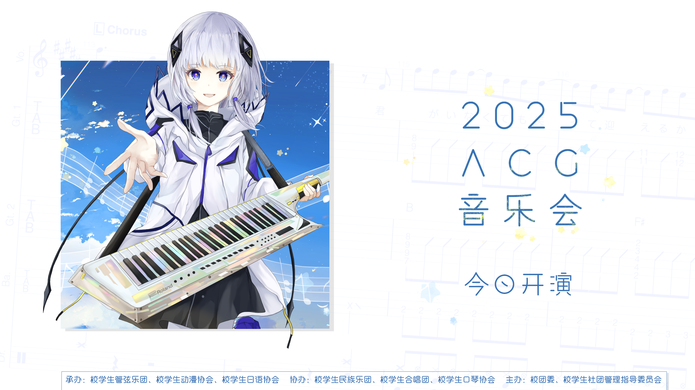

2025年的ACG音乐会上，*@[桜舞Phymusics](https://space.bilibili.com/667802747?spm_id_from=333.1387.follow.user_card.click)*和*@[洛叶p](https://space.bilibili.com/381865582?spm_id_from=333.1387.follow.user_card.click)*为作为主持人的洛天依和乐正绫制作语调，让她们念出串场词。*@[迭羽P](https://space.bilibili.com/148968488?spm_id_from=333.1387.follow.user_card.click)*和*@[洛叶p](https://space.bilibili.com/381865582?spm_id_from=333.1387.follow.user_card.click)*制作的翻调作品《致你》登上第一阶段的压轴节目。

## 2025/5/23
晚上好！这里依旧是为大家带来 ACG 音乐会节目预告的Leo酱~
距离音乐会开始只有不到48小时了，今年的节目情报有没有吸引到大家呢~
这次Leo酱要介绍的节目来自一位新面孔，那就是去年刚刚成立、专注于虚拟歌姬调校技术及其文化研究的USTC歌声合成技术协会~
在本次音乐会上，他们将用洛天依和乐正绫的歌声为我们带来虚拟歌姬翻调《致你》。
名为「南北组」的红与蓝的对唱，于层层涟漪的「共鸣」之中将情绪传递。
「若想念是凋谢的云 乘着风也飘向你 降落在你耳边低语」
机械揉捻而成的歌声，也可以传递挚爱吗？
这个问题的回答，就让我们两天后在两位歌姬婉转的歌声中试着探寻吧~
诶，大家还在吗？Leo酱探头.jpg
Leo酱听说啊，歌声合成技术协会在本次的 ACG 音乐会中不仅为我们带来了精彩的曲目，还会有其他精彩的表现呢~
不过要是Leo酱再多说估计就要剧透了，就让我们在音乐会当天揭晓吧~ 、

## 2025/5/25
时间的沙粒即将落位，礼堂的大门缓缓打开——嘿嘿，是不是感觉有点帅气呢？Leo酱已经到达东区大礼堂喽，这里多了一个超大的签绘墙欸，如果想要留下作品的话可得早点过来。
也差不多该揭晓本次 ACG 音乐会的主持人了，她们就是——洛天依小姐和乐正绫小姐！Leo酱也一直很喜欢她们，这次能请到二位真是太幸运了。
对了，Leo酱再再再强调一下，本届 ACG 音乐会入场时间是18：30，开演时间是19：00，大家到时候一定要有序入场，千万不要错过了哦！
那么就这样，Leo酱在东区大礼堂等着你们哟！

## 在ACG音乐会的现场

现场演出视频：[【洛天依&乐正绫】致你【原创PV付】【南北组】【2025中国科大ACG音乐会单品】](https://www.bilibili.com/video/BV1Ku3czxEzM)