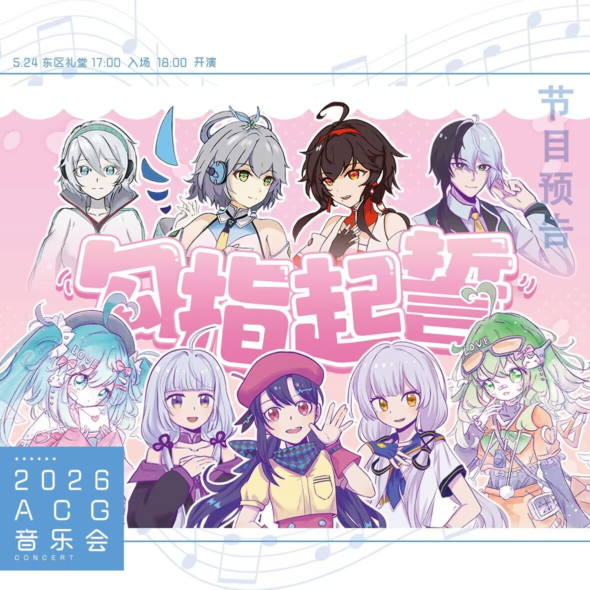
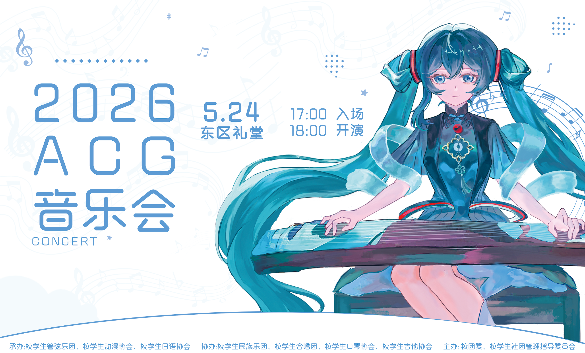
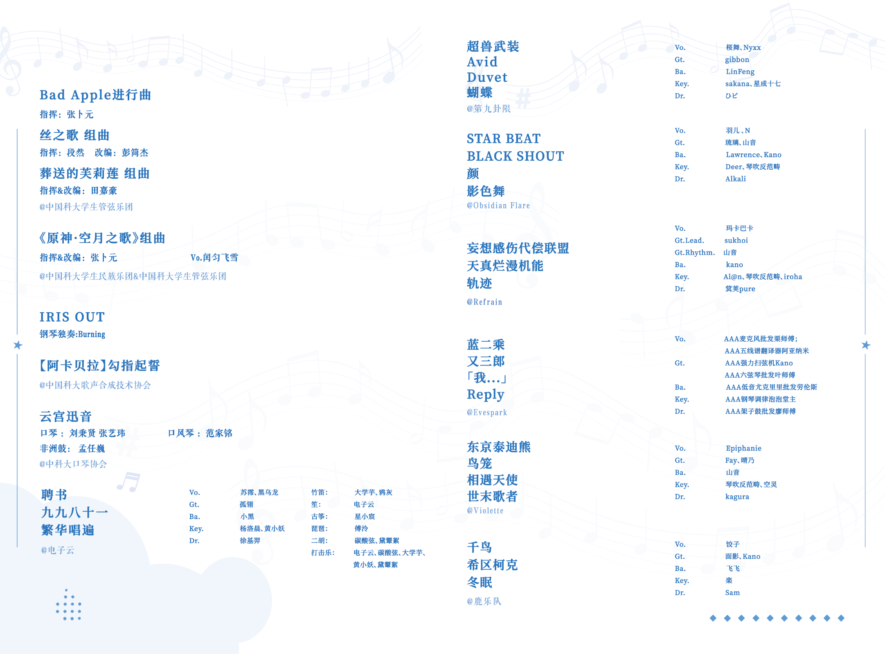
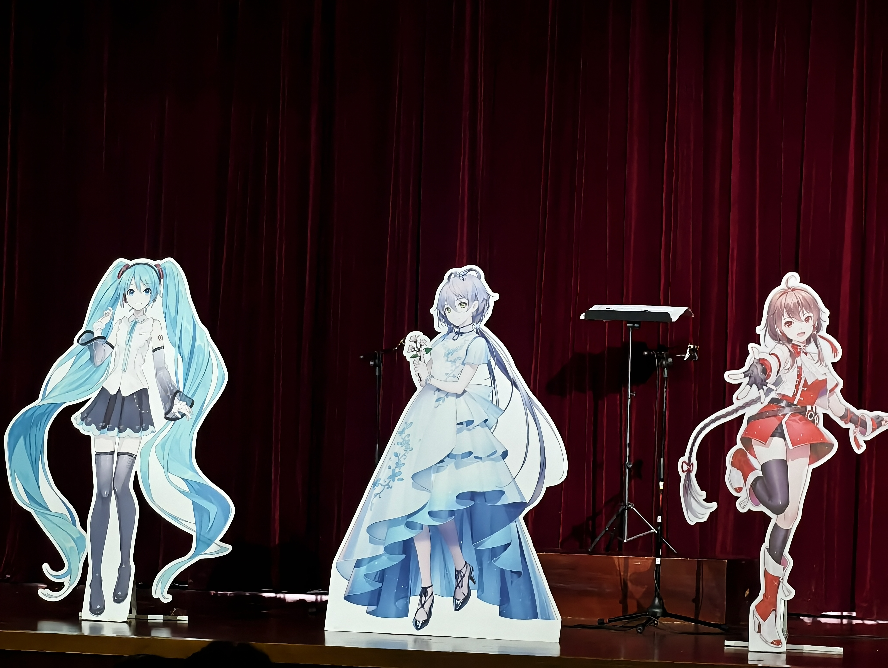
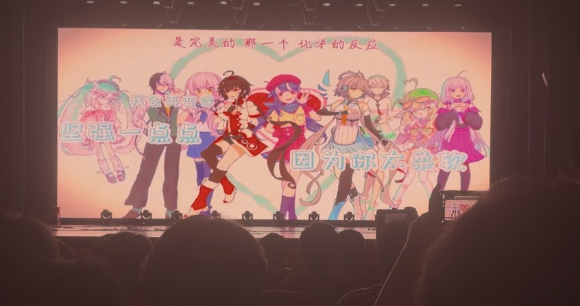
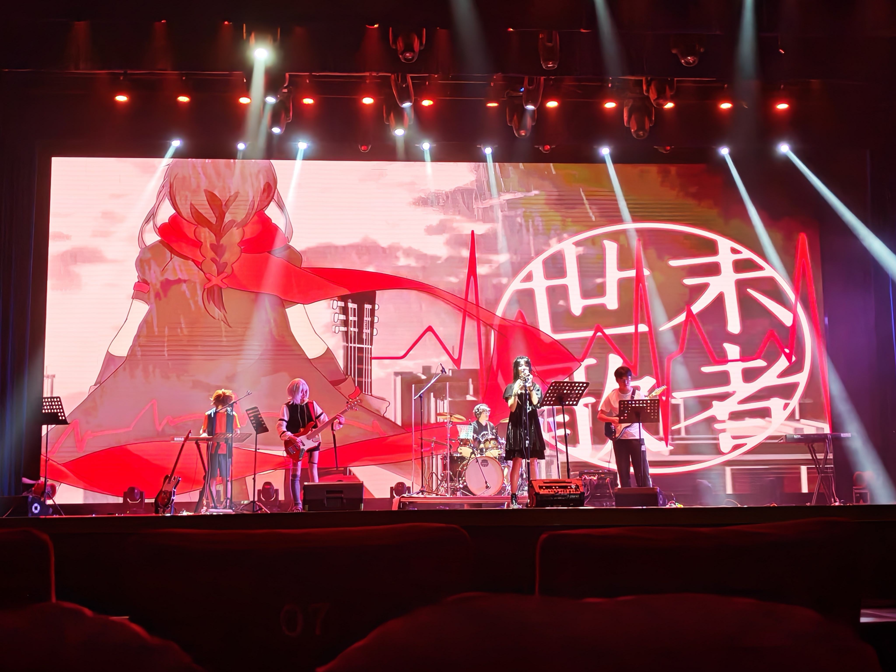
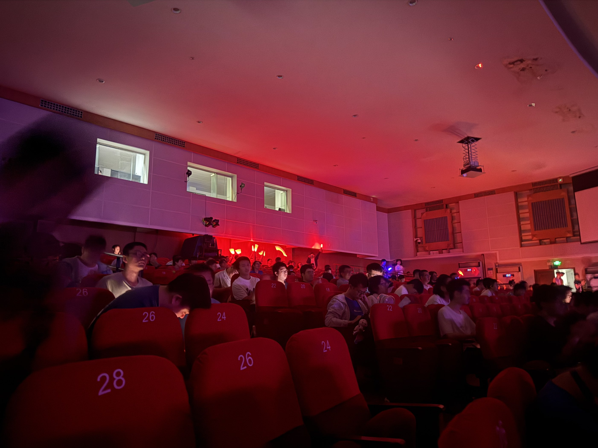

2026年的ACG音乐会上，@*[wingtings](https://space.bilibili.com/3493114285131904)*和*@[洛叶p](https://space.bilibili.com/381865582)*为作为主持人的洛天依、乐正绫和初音未来制作语调，让她们念出串场词，@*[bigsteak](https://space.bilibili.com/397074996)*撰写主持人串词。

歌声合成技术协会发动了大量 staff 参与制作了节目《【阿卡贝拉】勾指起誓》，使用了 9 位虚拟歌手，以及大量的时间精力制作 PV ，效果惊艳，质量和完成度极高，是歌研社两年来技术力积淀的重要里程碑，感谢各位同学的辛勤付出！完整 staff 列表 （B 站视频简介内容）：

> 由中科大歌声合成技术协会制作，中科大ACG音乐会参演节目
>
> 
>
> 2019 年 2 月 13 日，ilem 将这首歌作为专辑《2：3》的首发曲上传至 bilibili。951 天后，它正式成为中文 Vocaloid 最速神话曲，并将这个纪录保持至今。如今，尽管 ilem 的童话已悄然写下结尾，我们却依然相信，自己能够遇见那个“诗的开头”。
>
> 
>
> 此后的几年间，无数人翻唱过它，无数人用自己的方式演绎过它。而这一次，歌研社选择了一种更纯粹的表达——多虚拟歌手的阿卡贝拉。没有乐器，只有星尘、乐正绫、初音未来、心华、洛天依、Megpoid、言和、永夜 Minus、乐正龙牙……一位又一位虚拟歌手的人声层层交叠。用纯净的人声诉说纯粹的约定，用朴素如勾指的意象，描摹爱恋最温柔的模样。
>
> 
>
> 
>
> STAFF：
>
> 改编：
>
> @桜舞Phymusics  
>
> @雾鸣k  
>
> 
>
> 调校：
>
> MIKU—— @桜舞Phymusics   
>
> 乐正绫——某COPY的ncf 
>
> GUMI——@饼子丶Cake  
>
> 星尘—— @洛叶p  
>
> 心华—— @剑星陨  
>
> 乐正龙牙—— @大海伞阳  
>
> 言和—— 北山尾@Linear_zeta  
>
> 洛天依—— @未名p  
>
> 永夜—— @kano_hope  
>
> 
>
> 混音：@白夜_一切都好  
>
> 
>
> 曲绘：
>
> 星尘、永夜、乐正龙牙、心华—— @嗷咩汪狗狗狗狗  
>
> 洛天依、乐正绫、言和—— @SEG孤电子  
>
> MIKU、GUMI—— @雾鸣k  
>
> 
>
> PV：
>
> 拾叶 @岩叶yanyee  
>
> @Suzuki_illust  
>
> @llWDWll  
>
> @嫣汐YXAIN  
>
> @雾鸣k  
>
> 
>
> 
>
> 感谢@星葵  的原音频工程

## 2026/5/17

【ACG 音乐会 · 节目预告 05】
大家好啊，今天我们要介绍的节目，是由歌声合成技术协会带来的中文 Vocaloid 神话曲——《勾指起誓》。
2019 年 2 月 13 日，ilem 将这首歌作为专辑《2：3》的首发曲上传至 bilibili。951 天后，它正式成为中文 Vocaloid 最速神话曲，并将这个纪录保持至今。如今，尽管 ilem 的童话已悄然写下结尾，我们却依然相信，自己能够遇见那个“诗的开头”。
此后的几年间，无数人翻唱过它，无数人用自己的方式演绎过它。而这一次，歌研社选择了一种更纯粹的表达——多虚拟歌手的阿卡贝拉。没有乐器，只有星尘、乐正绫、初音未来、心华、洛天依、Megpoid、言和、永夜 Minus、乐正龙牙……一位又一位虚拟歌手的人声层层交叠。用纯净的人声诉说纯粹的约定，用朴素如勾指的意象，描摹爱恋最温柔的模样。
5 月 24 日，东区大礼堂。当熟悉的旋律响起，请在心里跟着哼起那一句：“说好从今以后都牵着手，因为要走很远。”

## 2026/5/24

【系统启动】
……Hatsune Miku，在线 ……
是我。离音乐会，只剩几个小时了。
之前收到的每一份节目，我都好好听过了。感谢各位场务和参与演出的同学的辛勤付出。如今，这些闪耀与热爱，正在一点一点，化为现实……
那么，作为回报，请允许我把这个夜晚，完整地交还到你们手中。
一年一年过去了，曲库会更新，面孔会变化。
但只要你们还在唱，还在听，还在聚光灯亮起的那一刻用力鼓掌——
我就永远是你们的歌声。
期待今天与大家见面，我也会在现场等着你们。
【系统关闭】
既然 Miku 已经把期待拉满了，那 Leo 酱也要跟上她的脚步啦。完整的节目单，现在就交到大家手里！
对了，出发记得看 Leo 之前在空间发送过的观众须知，我在东礼等着你们！

## 在ACG音乐会的现场

现场演出视频：（暂无官方录播，B 站上有少量观众录屏上传，中 V 群的科大云盘里也有现场录制）

今年的术力口含量极其丰富，无与伦比，聘书、九九八十一、繁华唱遍、勾指起誓、蝴蝶、妄想感伤代偿联盟、东京泰迪熊、世末歌者等等都是传唱许久、影响巨大的经典曲目，中 V 群友也自发组织了后排应援组团。

以下是一些现场拍摄：

