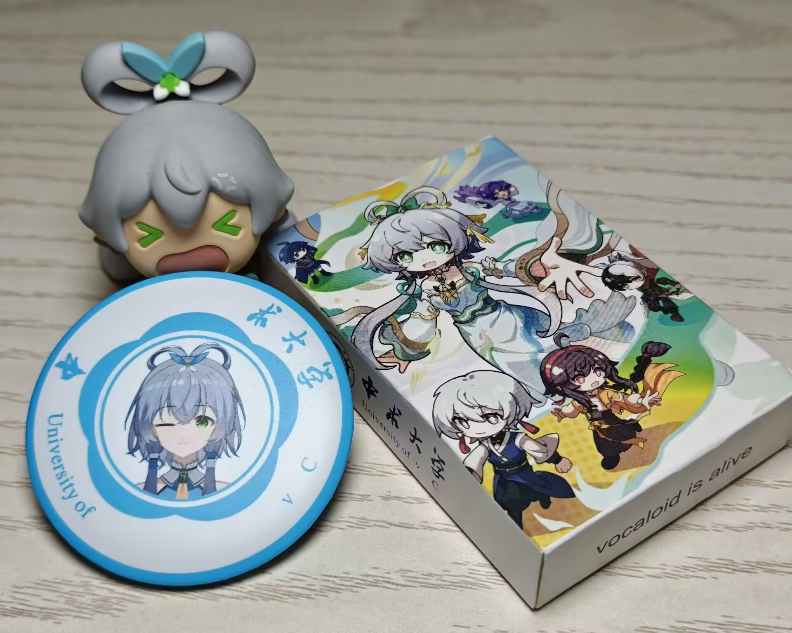
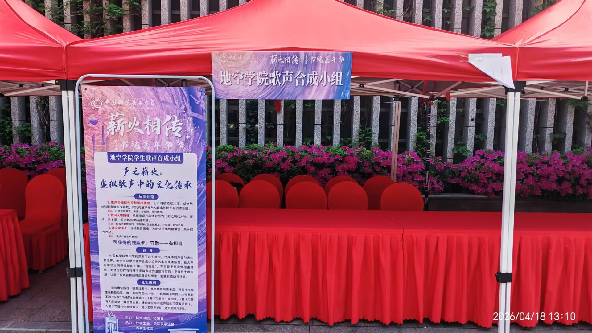

2026 年 4 月 18 日，在@[*立方体*](/Others/People/立方体)的倡议下，歌声合成技术协会决定参加书院嘉年华摆摊活动，以提高社团知名度，扩大影响力，让更多同学体验歌声合成技术的神奇。活动主策划为 @*[未名.](https://space.bilibili.com/3461567427381799)* ，活动时间为当天 16:00 到 20:00。

## 活动预热集赞说说

书院嘉年华·地空学院学生歌声合成小组预热：
【集赞】
大家好，我们是地空学院学生歌声合成小组！
本次活动中，我们将社团的日常活动带到了现场，准备了多种互动环节，无论你是想实际上手调校，还是单纯对虚拟歌姬好奇，都能在这里找到乐趣！
【调校体验】使用歌声合成软件，你可以根据简谱，在经验丰富的同学带领下亲自画出旋律和输入歌词，调整参数，将虚拟歌姬的歌声调校成你心目中的样子。或者使用新形态的AI合成编辑器，无需手工调校，仅需输入旋律和歌词即可产出歌曲，体验其高度拟人化的音色、呼吸和情感。你只需要一点灵感，就能创作出情绪饱满的人声旋律！
调校结束后，你不仅可以领取精美的奖品，还可以用光盘刻录你的成果，将你的成果实体保存下来！
【手工制作】我们提供空白线稿、明信片，你可以绘制独具创意的明信片，为线稿填色；我们还提供了吧唧制作材料，挑选你喜欢的虚拟歌姬，亲手制作周边吧唧！
【歌词猜谜】我们精挑细选了包含古代、近现代知名人物事件的歌曲，你需要从歌词中猜出背后的历史人物或事件，在歌声合成技术的载体下感受历史，还能带走丰富答题小奖品，答对越多，奖励越多！
时间：4月18日下午16：00-20：00
地点：中区书院嘉年华歌声合成小组摊位
而且，集赞也有奖品哦：
将本推文转发至qq空间
集赞18个 主题卡套（限5个）、便利贴（限10本）、吧唧（限20个）、明信片（限20张）任选一；
集赞36个 NFC歌曲冰箱贴（限6个）、流光协奏拍立得（限5张）、社团主题扑克牌（限10副）任选一；
集赞72个 洛天依毛绒玩具一只（限三只）。
领取方式：4月18日活动当天凭借说说领取。
多多转发，先到先得哦！
从人声到虚拟歌声，技术让通过音符传递情感变得愈加平权，让通过乐声的表达有了更多可能。我们是地空学院学生歌声合成小组，这份跨越了音乐与技术的传承薪火，期待与你相遇！

## 现场照片

